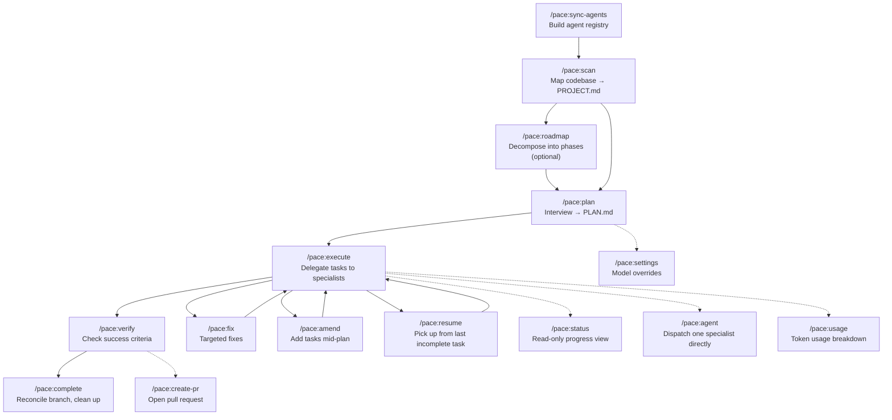
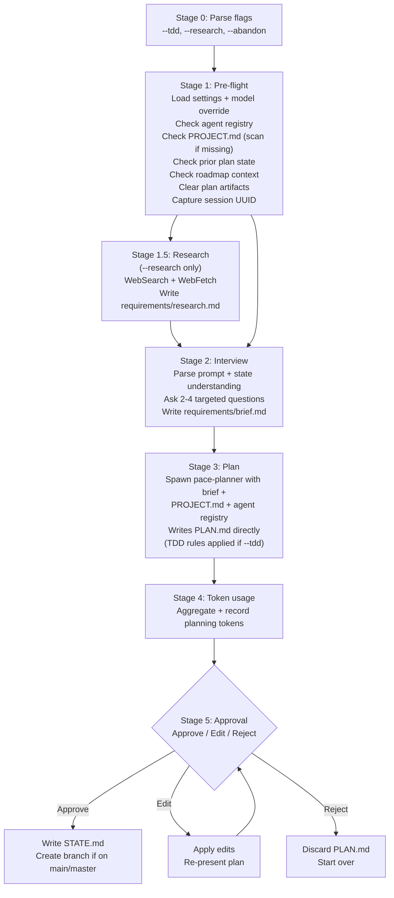
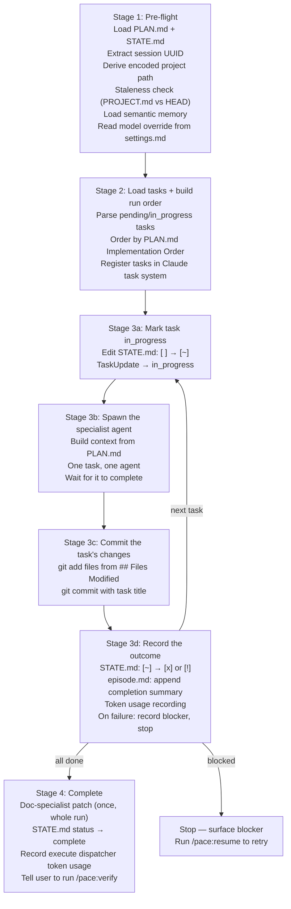

# PACE

**Plan, Assign, Coordinate, Execute**

A spec-driven development workflow for Claude Code. PACE interviews you for requirements, produces atomic plans, and delegates every task to the right specialist agent. No single-session degradation, no agents doing work outside their expertise.

PACE doesn't ship its own agents — it discovers whatever agents you have installed and routes to them intelligently. Bring your own agent roster.

## How It Works

1. **Sync** — PACE scans your installed agents and builds a two-tier registry
2. **Scan** — PACE maps your codebase structure and writes `PROJECT.md` so agents have accurate context
3. **Plan** — An interview extracts requirements; a single planner agent turns them into `PLAN.md`
4. **Execute** — Each task is delegated to its assigned specialist agent, one at a time in Implementation Order; each task is committed before the next begins
5. **Verify** — Completed work is checked against the plan's success criteria
6. **Complete** — Branch is reconciled, runtime files are cleaned up, and the PR is finalised

Tasks are atomic: each has one agent owner, is completable in one session, and has observable success criteria. Plan size is not artificially limited — a plan has as many tasks as the work genuinely requires.

## Lifecycle Diagram



## Quick Start

### Install

```bash
# Global — available in all projects
./install.sh

# Project-scoped — committed to repo, shared with team
./install.sh --local
```

### First Run

```bash
# 1. Build the agent registry (required before planning)
/pace:sync-agents

# 2. Map your codebase (required before planning)
/pace:scan

# 3. Start planning
/pace:plan
```

## Commands

| Command | What it does |
|---|---|
| `/pace:sync-agents` | Scan installed agents and build the PACE agent registry |
| `/pace:scan` | Scans the codebase and produces `.pace/PROJECT.md` for use by planning and execution agents |
| `/pace:roadmap` | Interview the user, decompose a large feature into phases, and produce `ROADMAP.md` |
| `/pace:plan` | Interview the user, then produce `PLAN.md` via a single planner agent |
| `/pace:execute` | Reads `PLAN.md`, delegates each task to the assigned specialist agent, and tracks progress in `STATE.md` |
| `/pace:verify` | Checks completed work against `PLAN.md` success criteria using the pace-verification-specialist |
| `/pace:fix` | Dispatches targeted fixes within the PACE lifecycle — structured by default, `--light` for quick one-shot fixes |
| `/pace:amend` | Adds new tasks to the current plan mid-execution — structured by default, `--light` for quick one-shot additions |
| `/pace:status` | Shows the current plan status, progress, and suggested next steps — read-only, no work is executed |
| `/pace:resume` | Picks up execution from the last incomplete task in `STATE.md` |
| `/pace:create-pr` | Creates a PR from the PACE workflow — summarising what was requested, what was delivered, and what was verified |
| `/pace:settings` | View and manage PACE workflow settings |
| `/pace:usage` | Display token usage and cost breakdown for the current plan — grand total, per-phase subtotals, and per-task detail rows |
| `/pace:complete` | Closes out a completed plan — full `PROJECT.md` refresh and `.pace/` runtime cleanup |
| `/pace:agent` | Dispatches a specialist agent with baked-in codebase context — no blind exploration needed |

## Command Internals

### /pace:plan



### /pace:execute



## Agent Registry

PACE uses a two-tier registry to avoid loading 100+ agent descriptions into context when only a few are needed.

**Tier 1** — `.pace/AGENT-REGISTRY.md` is a division-level index. The planner always loads this and uses it to identify which divisions are relevant to the current work.

**Tier 2** — `.pace/agents/{division}.md` files contain the full agent list per division. Only relevant divisions are loaded during planning.

Run `/pace:sync-agents` any time you install, remove, or update agents. The registry is committed to the repo so the whole team stays in sync.

## Runtime Files

PACE creates a `.pace/` directory in your project root:

```
.pace/
  AGENT-REGISTRY.md        # Tier 1 — division index (commit this)
  agents/                  # Tier 2 — per-division agent lists (commit these)
  ROADMAP.md               # Phase decomposition for large features (persists across plans)
  PLAN.md                  # Current plan with tasks and success criteria
  STATE.md                 # Operational memory — task status and blockers
  PROJECT.md               # Codebase map — stack, structure, conventions
  settings.md              # Persistent configuration — not cleared by /pace:complete
  usage.md                 # Token usage and cost tracking — per-phase and per-task breakdown
  memory/
    episode.md             # Episodic memory — what was built this execution (cleared at complete)
    semantic.md            # Semantic memory — cross-plan decisions and patterns (never cleared)
  requirements/
    brief.md               # Compiled interview requirements (plan-specific)
    research.md            # Research findings (plan-specific, --research only)
```

`AGENT-REGISTRY.md`, `agents/`, `PROJECT.md`, and `settings.md` are safe to commit. The rest are plan-scoped runtime state.

## Configuration

PACE reads `.pace/settings.md` for persistent workflow configuration. This file is never cleared by `/pace:complete`, so your preferences carry across plans. Use `/pace:settings` to view and modify settings interactively, or pass arguments directly (e.g. `/pace:settings set execute-model opus`).

### Model Override

Two separate settings control planning and execution phases independently:

```markdown
# Settings
_Persistent configuration for the PACE workflow. This file is not cleared by /pace:complete._

## Model
plan-model: opus
execute-model: sonnet
```

| Setting | Accepted values | Which agents it controls |
|---|---|---|
| `plan-model` | `sonnet`, `opus`, `haiku` | Planner, roadmap planner, research agents, codebase analyst |
| `execute-model` | `sonnet`, `opus`, `haiku` | Specialist implementers, verification, fix agents, documentation patches |

**Which commands read which setting:**
- **`plan-model`**: `/pace:plan`, `/pace:roadmap`, `/pace:scan`
- **`execute-model`**: `/pace:execute`, `/pace:fix`, `/pace:amend`, `/pace:verify`, `/pace:complete`, `/pace:agent`

The orchestrator session model is unaffected. When a field is blank or `settings.md` does not exist, agents inherit the session model as before.

## Key Principles

**The orchestrator never implements.** Every task is delegated to a specialist. The orchestrator routes — it doesn't code, write, or design.

**Fresh context per task.** Each task runs in an isolated agent session. No context degradation across a multi-task plan.

**Tasks are atomic.** Each task has one agent owner, is completable in one session, and has observable success criteria. Plan size is not artificially limited — a plan contains as many tasks as the work genuinely requires.

**Verification is goal-backward.** Success criteria describe what must be true, not what was done.

**Bring your own agents.** PACE routes to whatever agents are installed. It works with Agency Agents, custom agents, or any combination. If no agent fits a task, the planner flags it instead of falling back to direct implementation.

**State is simple.** A single `STATE.md` file tracks all task progress. No state machine, no database.

## Install Targets

| Flag | Destination | Use case |
|---|---|---|
| `--global` (default) | `~/.claude/` | Solo dev, available everywhere |
| `--local` | `./.claude/` | Team project, committed to repo |

## Uninstall

```bash
# Remove PACE commands and agents
./uninstall.sh

# Also remove runtime files (.pace/)
./uninstall.sh --include-runtime

# Remove from a local install
./uninstall.sh --local --include-runtime
```

The uninstaller only removes PACE files — it never touches your other agents or commands.

## Requirements

- Claude Code with agent and command support
- Specialist agents installed (e.g. [Agency Agents](https://github.com/wshobson/agents) or your own)

## License

MIT
