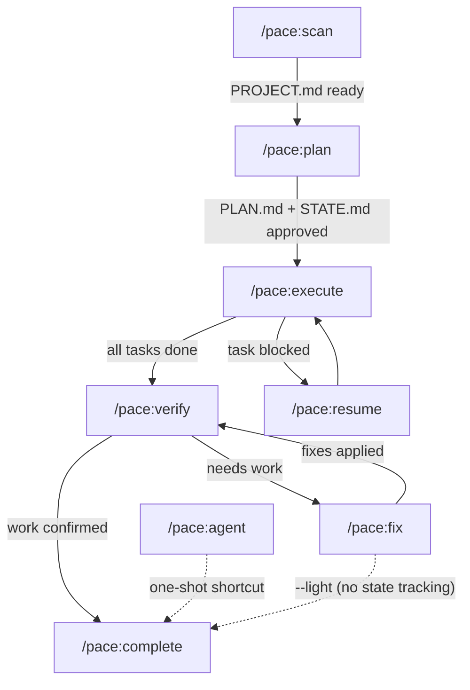
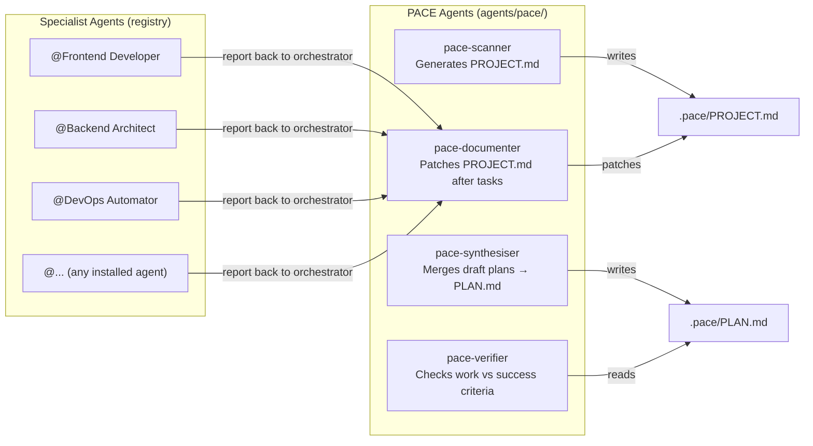
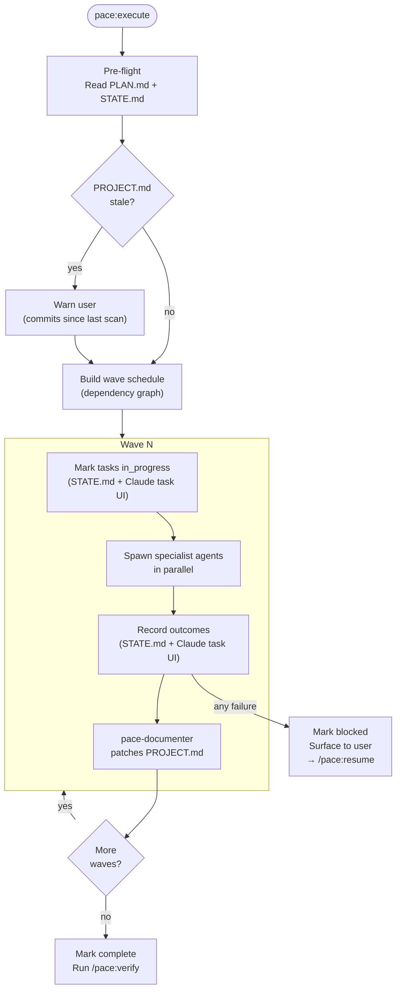
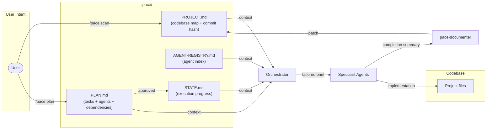
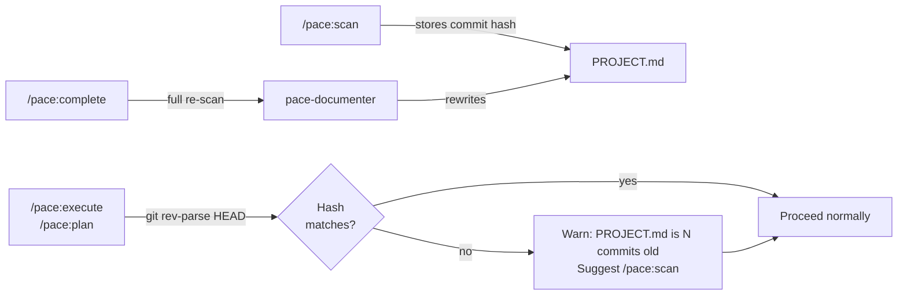

# PACE Architecture

## Command Lifecycle

```mermaid
flowchart TD
    scan["/pace:scan"]
    plan["/pace:plan"]
    execute["/pace:execute"]
    agent["/pace:agent"]
    verify["/pace:verify"]
    fix["/pace:fix"]
    complete["/pace:complete"]
    resume["/pace:resume"]

    scan -->|PROJECT.md ready| plan
    plan -->|PLAN.md + STATE.md approved| execute
    execute -->|all tasks done| verify
    verify -->|work confirmed| complete
    verify -->|needs work| fix
    fix -->|fixes applied| verify
    execute -->|task blocked| resume
    resume --> execute

    agent -.->|one-shot shortcut| complete
    fix -.->|"--light (no state tracking)"| complete
```

## Agent Roster

```mermaid
flowchart LR
    subgraph pace-agents["PACE Agents (agents/pace/)"]
        scanner["pace-scanner\nGenerates PROJECT.md"]
        synthesiser["pace-synthesiser\nMerges draft plans → PLAN.md"]
        documenter["pace-documenter\nPatches PROJECT.md after tasks"]
        verifier["pace-verifier\nChecks work vs success criteria"]
    end

    subgraph specialists["Specialist Agents (registry)"]
        fe["@Frontend Developer"]
        be["@Backend Architect"]
        dv["@DevOps Automator"]
        etc["@... (any installed agent)"]
    end

    scanner -->|writes| project[".pace/PROJECT.md"]
    synthesiser -->|writes| plan[".pace/PLAN.md"]
    documenter -->|patches| project
    verifier -->|reads| plan

    fe & be & dv & etc -->|report back to orchestrator| documenter
```

## Execute Wave Flow

```mermaid
flowchart TD
    start(["pace:execute"]) --> preflight["Pre-flight\nRead PLAN.md + STATE.md"]
    preflight --> stale{"PROJECT.md\nstale?"}
    stale -->|yes| warn["Warn user\n(commits since last scan)"]
    stale -->|no| waves
    warn --> waves

    waves["Build wave schedule\n(dependency graph)"]
    waves --> wave1

    subgraph wave1["Wave N"]
        mark["Mark tasks in_progress\n(STATE.md + Claude task UI)"]
        spawn["Spawn specialist agents\nin parallel"]
        mark --> spawn
        spawn --> outcomes["Record outcomes\n(STATE.md + Claude task UI)"]
        outcomes --> doc["pace-documenter\npatches PROJECT.md"]
    end

    doc --> more{"More\nwaves?"}
    more -->|yes| wave1
    more -->|no| done["Mark complete\nRun /pace:verify"]

    outcomes -->|any failure| blocked["Mark blocked\nSurface to user\n→ /pace:resume"]
```

## Data Flow

```mermaid
flowchart LR
    subgraph inputs["User Intent"]
        user(["User"])
    end

    subgraph runtime[".pace/"]
        project["PROJECT.md\n(codebase map + commit hash)"]
        registry["AGENT-REGISTRY.md\n(agent index)"]
        plan["PLAN.md\n(tasks + agents + dependencies)"]
        state["STATE.md\n(execution progress)"]
    end

    subgraph outputs["Codebase"]
        code["Project files"]
    end

    user -->|"/pace:scan"| project
    user -->|"/pace:plan"| plan
    plan -->|approved| state
    project & registry & plan & state -->|context| orchestrator["Orchestrator"]
    orchestrator -->|tailored brief| specialists["Specialist Agents"]
    specialists -->|completion summary| documenter["pace-documenter"]
    specialists -->|implementation| code
    documenter -->|patch| project
```

## PROJECT.md Freshness

```mermaid
flowchart LR
    scan["/pace:scan"] -->|stores commit hash| project["PROJECT.md"]
    execute["/pace:execute\n/pace:plan"] -->|git rev-parse HEAD| check{"Hash\nmatches?"}
    check -->|yes| proceed["Proceed normally"]
    check -->|no| warn["Warn: PROJECT.md is N commits old\nSuggest /pace:scan"]
    warn --> proceed

    complete["/pace:complete"] -->|full re-scan| documenter["pace-documenter"]
    documenter -->|rewrites| project
```
