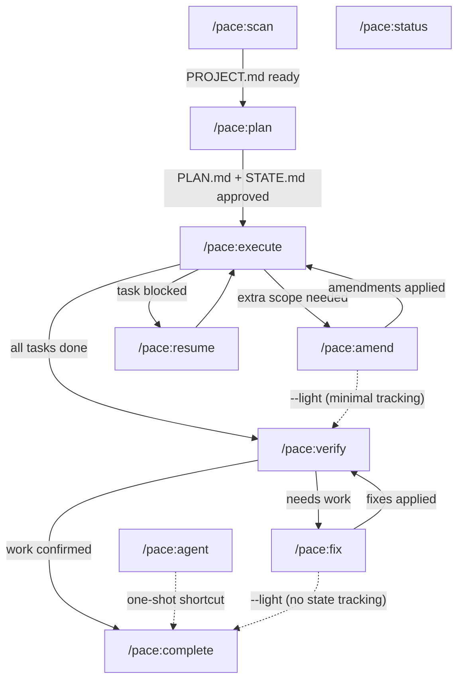
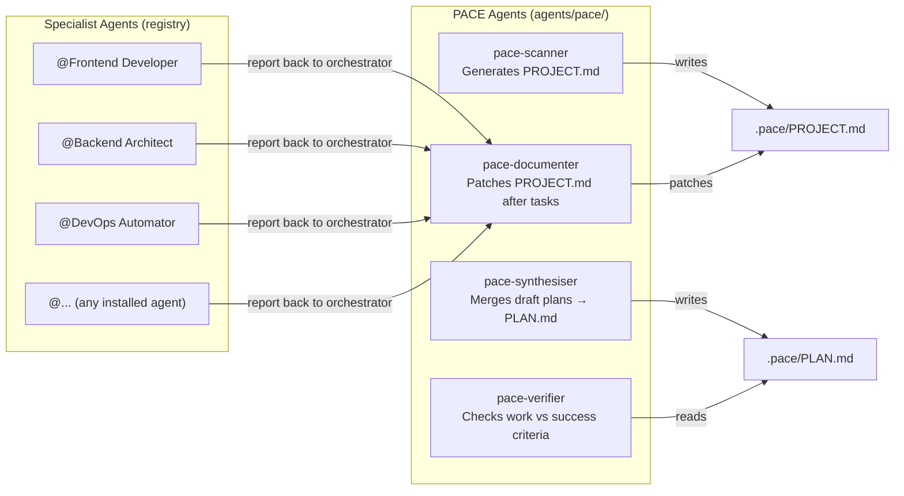
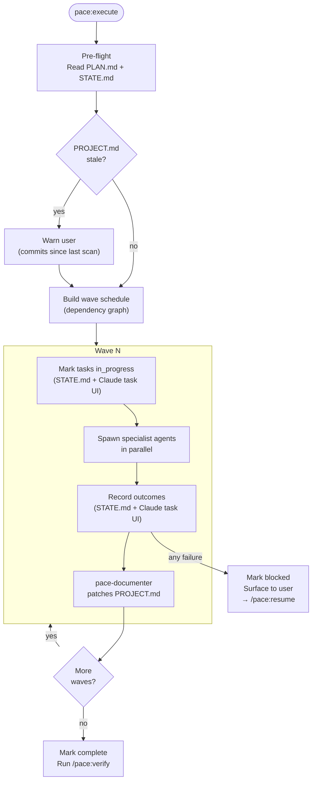
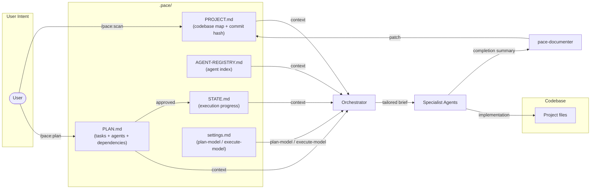
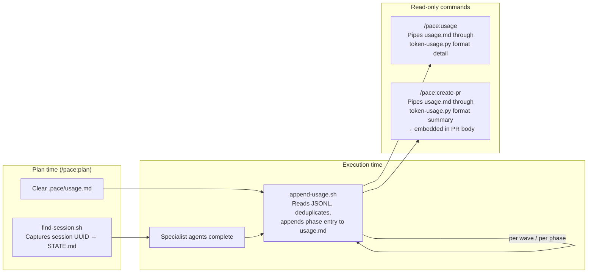
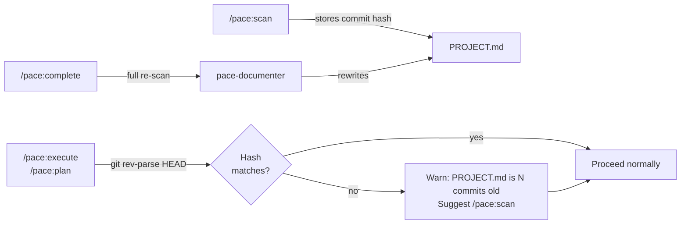

# PACE Architecture

## Command Lifecycle

## Agent Roster

## Execute Wave Flow

## Data Flow

**Settings override**: The orchestrator reads `settings.md` at command time and passes the appropriate model parameter to specialist agent spawns. Planning commands (`/pace:plan`, `/pace:roadmap`, `/pace:scan`) read `plan-model`. Execution commands (`/pace:execute`, `/pace:verify`, `/pace:fix`, `/pace:amend`, `/pace:complete`, `/pace:agent`) read `execute-model`. This allows planning agents to run on a stronger model for architectural reasoning while execution agents run on a faster, cheaper model for bounded work. The orchestrator's own model always matches the session model.

## Token Usage Tracking

**Token tracking lifecycle**: At plan time, `find-session.sh` identifies the current Claude Code session UUID from the process tree and writes it to `STATE.md`. `/pace:plan` also clears `.pace/usage.md` so each plan starts with a fresh ledger. After each agent completes — in `/pace:execute` (per wave), `/pace:verify`, `/pace:fix`, and `/pace:amend` — `append-usage.sh` calls `token-usage.py aggregate` to parse the session's JSONL file, deduplicate entries already recorded, and append a new phase row to `usage.md`. `/pace:usage` reads the accumulated `usage.md` and pipes it through `token-usage.py format detail` to render a per-task breakdown table. `/pace:create-pr` pipes the same file through `token-usage.py format summary` to embed a cost summary in the PR body. `/pace:complete` preserves `usage.md` during cleanup so the record survives plan finalisation.

## PROJECT.md Freshness

